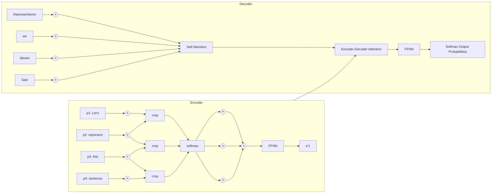
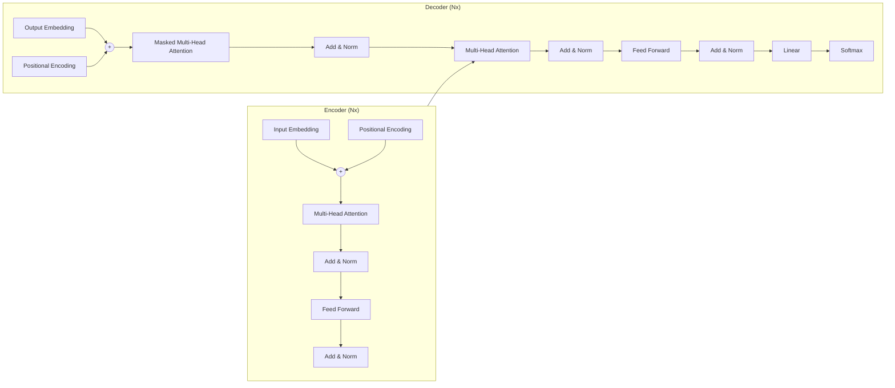
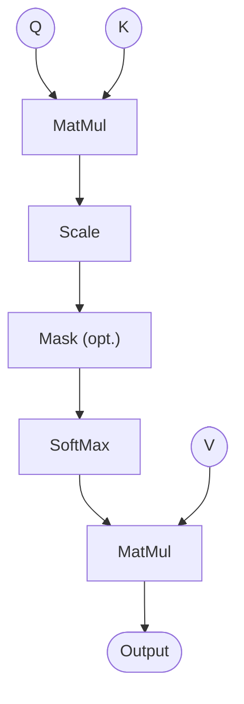
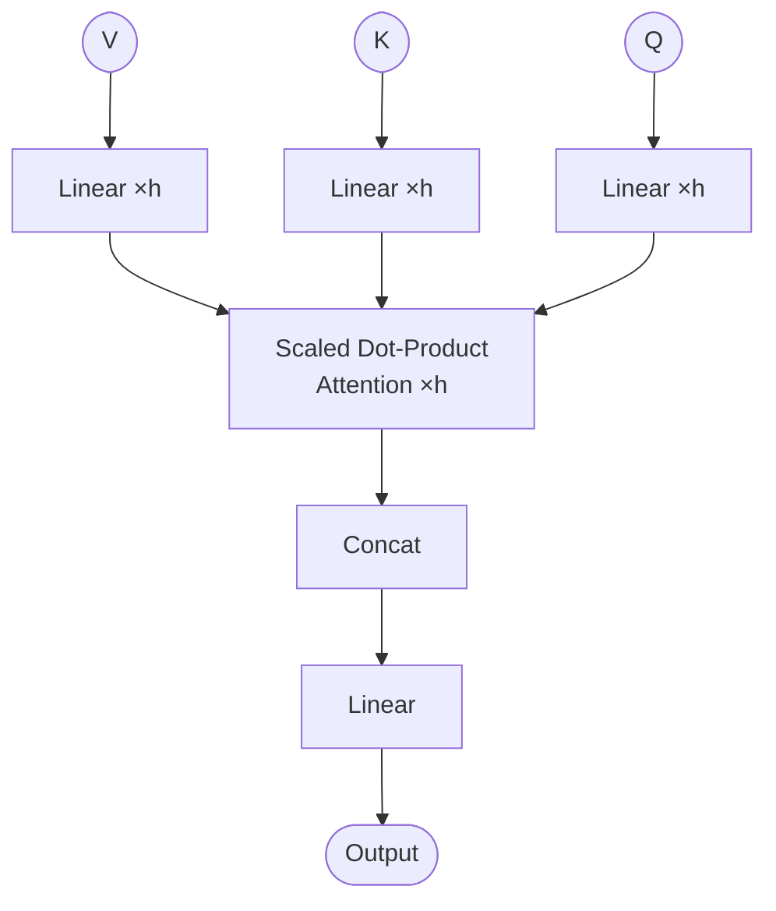

# [**Vaswani et al. (2017)** — "Attention Is All You Need" (Transformer) **LANDMARK PAPER**](https://arxiv.org/pdf/1706.03762)

Recurrent neural networks, long short-term memory and gated recurrent neural networks are used for sequence modeling.
we need to compute based on previous results and the new input

h\sub{t}=f(h\sub{t-1},t)
This inherently
sequential nature precludes parallelization within training examples, which becomes critical at longer
sequence lengths, as memory constraints limit batching across examples.

RNN with sequence aligned states(one token at a time) seems wasteful cause makes it hard to learn for long-range dependencies.

Previous Solutions (CNN-based models):
- ConvS2S, ByteNet, Extended Neural GPU compute all positions simultaneously (parallel)
- Downside: To connect two distant positions, you need to "hop" through layers — the number of operations grows with distance (linearly or logarithmically)

The Transformer Solution:
- Uses self-attention to connect any two positions directly in constant time (O(1) operations)
- Trade-off: Attention averages over all positions, losing some positional precision
- Fix: Multi-Head Attention (section 3.2) — runs multiple attention "heads" in parallel to capture different types of relationships

In short: The Transformer replaces sequential or convolutional computation with attention, making it faster to relate distant elements, while multi-head attention compensates for the "blurring" effect of averaging.






## **Encoder and Decoder Stacks**

**Encoder (N = 6 layers)**

* Each layer has **2 sublayers**:

  1. **Multi-head self-attention**
  2. **Position-wise feed-forward network (FFN)**
* Each sublayer uses:

  * **Residual connection**
  * **Layer normalization**
* Output formula:

  ```
  LayerNorm(x + Sublayer(x))
  ```
* All outputs have dimension:

  ```
  d_model = 512
  ```

**Decoder (N = 6 layers)**

* Each layer has **3 sublayers**:

  1. **Masked multi-head self-attention**
  2. **Encoder–decoder attention**
  3. **Position-wise feed-forward network**
* Each sublayer uses:

  * **Residual connection**
  * **Layer normalization**
* Masked self-attention ensures:

  * token i attends only to tokens < i
  * prevents future information leakage
* Output embeddings are **shifted right** (autoregressive prediction)


## Attention
It is like mapping a query and a set of key-value pairs to an output, where the query, keys, values, and output are all vectors.

**Scaled Dot-Product Attention**


Input: queries and keys of dimension dk, and values of dimension dv
weights: $softmax(\frac{(Q.K.T)}{\sqrt{d_{k}}})$

Attention(Q,K,V)= $softmax(\frac{(Q.K.T)}{\sqrt{d_{k}}}) * V$


**Multi-Head Attention**

 linearly project the queries, keys and values h times with different, learned
linear projections to $d\sub{k}$, $d\sub{k}$ and $d\sub{v}$ dimensions, respectively.




The ×h notation on the linear layers and the attention block denotes the h parallel heads shown in the original diagram.


Multi-head attention allows the model to jointly attend to information from different representation subspaces at different positions. With a single attention head, averaging inhibits this.

$$
\text{MultiHead}(Q, K, V) = \text{Concat}(\text{head}_1, ..., \text{head}_h)W^O
$$

$$
\text{where } \text{head}_i = \text{Attention}(QW_i^Q, KW_i^K, VW_i^V)
$$

Where the projections are parameter matrices $W_i^Q \in \mathbb{R}^{d_{\text{model}} \times d_k}$, $W_i^K \in \mathbb{R}^{d_{\text{model}} \times d_k}$, $W_i^V \in \mathbb{R}^{d_{\text{model}} \times d_v}$ and $W^O \in \mathbb{R}^{h d_v \times d_{\text{model}}}$.

In this work we employ $h = 8$ parallel attention layers, or heads. For each of these we use $d_k = d_v = d_{\text{model}}/h = 64$. Due to the reduced dimension of each head, the total computational cost is similar to that of single-head attention with full dimensionality.


**Applications in our model:**
- In **encoder-decoder attention** layers, queries come from the previous decoder layer while keys and values come from the encoder output, allowing every decoder position to attend over all input sequence positions.
- In **encoder self-attention** layers, keys, values, and queries all come from the same place (the previous encoder layer), so each encoder position can attend to all positions in the previous encoder layer.
- In **decoder self-attention** layers, each position can attend to all positions up to and including itself — leftward information flow is prevented by masking illegal connections to $-\infty$ before the softmax, preserving the auto-regressive property.


**Position-wise Feed-Forward Networks:**
each layer is connected to a fully feed forward network. 2 linear transformation:
$$ FFN(x) = max(0, xW\sub{1} + b\sub{1})W\sub{2} + b\sub{2}  $$


**Embeddings & SoftMax**
Input + Output ----embeddings----> $d\sub{model}$

**Positional Encoding**
To make use of order of sequence, inject info about relative/absolute position of token to sequence model.
add "positional encodings" to the input embeddings at the bottoms of the encoder and decoder stacks.
multiple choices, ex:

$PE\sub{(pos,2i)} = sin(\frac{pos}{10000^{\frac{2i}{dmodel}}})$

$PE\sub{(pos,2i+1)| = cos(\frac{pos}{10000^{\frac{2i}{dmodel}}})$

*pos* position ; *i* dimension

# Why Self Attention
1. **Computational complexity** — Self-attention connects all positions in $O(1)$ sequential operations, making it faster than recurrent layers (which require $O(n)$) when sequence length $n < d$.

2. **Long-range dependencies** — Shorter signal paths between any two positions make it easier to learn long-range dependencies; self-attention achieves a constant maximum path length, unlike recurrent or convolutional layers.

3. **Interpretability** — Self-attention can yield more interpretable models, with individual attention heads appearing to learn distinct tasks related to the syntactic and semantic structure of sentences.

# Training

## Training Data and Batching

- **EN-DE:** WMT 2014 English-German, ~4.5M sentence pairs, byte-pair encoding, ~37000 token vocabulary
- **EN-FR:** WMT 2014 English-French, 36M sentences, 32000 word-piece vocabulary
- Batches contained ~25000 source and ~25000 target tokens

## Hardware and Schedule

- 8 NVIDIA P100 GPUs
- Base models: ~0.4s/step, 100,000 steps (12 hours)
- Big models: ~1.0s/step, 300,000 steps (3.5 days)

## Optimizer

Adam with $\beta_1 = 0.9$, $\beta_2 = 0.98$, $\epsilon = 10^{-9}$, with learning rate schedule:

$$
lrate = d_{\text{model}}^{-0.5} \cdot \min(step\_num^{-0.5},\ step\_num \cdot warmup\_steps^{-1.5})
$$

Learning rate increases linearly for the first $warmup\_steps = 4000$ steps, then decreases proportionally to the inverse square root of the step number.

## Regularization

- **Residual Dropout:** $P_{drop} = 0.1$ applied to each sub-layer output, and to the sums of embeddings and positional encodings
- **Label Smoothing:** $\epsilon_{ls} = 0.1$ — hurts perplexity but improves accuracy and BLEU score

## Results (Table 2)

| Model | BLEU EN-DE | BLEU EN-FR | Cost EN-DE (FLOPs) | Cost EN-FR (FLOPs) |
|---|---|---|---|---|
| ByteNet | 23.75 | — | — | — |
| GNMT + RL | 24.6 | 39.92 | $2.3 \cdot 10^{19}$ | $1.4 \cdot 10^{20}$ |
| ConvS2S | 25.16 | 40.46 | $9.6 \cdot 10^{18}$ | $1.5 \cdot 10^{20}$ |
| MoE | 26.03 | 40.56 | $2.0 \cdot 10^{19}$ | $1.2 \cdot 10^{20}$ |
| GNMT + RL Ensemble | 26.30 | 41.16 | $1.8 \cdot 10^{20}$ | $1.1 \cdot 10^{21}$ |
| ConvS2S Ensemble | 26.36 | **41.29** | $7.7 \cdot 10^{19}$ | $1.2 \cdot 10^{21}$ |
| Transformer (base) | 27.3 | 38.1 | $\mathbf{3.3 \cdot 10^{18}}$ | — |
| Transformer (big) | **28.4** | **41.8** | $2.3 \cdot 10^{19}$ | — |

# Results

### Machine Translation
- **EN-DE:** Transformer (big) achieves 28.4 BLEU — 2.0+ points above previous SOTA, at a fraction of training cost
- **EN-FR:** Transformer (big) achieves 41.0 BLEU — at less than 1/4 the training cost of previous SOTA
- Inference: beam size 4, length penalty $\alpha = 0.6$, max output length = input + 50

### Model Variations (Table 3)
- **(A)** Single-head attention is 0.9 BLEU worse than best; too many heads also hurts
- **(B)** Reducing $d_k$ hurts quality — dot product may not be the best compatibility function
- **(C)** Bigger models are better; **(D)** dropout is critical against overfitting
- **(E)** Learned positional embeddings perform nearly identically to sinusoidal

### English Constituency Parsing (Table 4)
- 4-layer Transformer achieves **91.3 F1** (WSJ only) and **92.7 F1** (semi-supervised)
- Outperforms all prior models except the RNN Grammar, with no task-specific tuning

---

# Implementation (`transformer.py`)

## Class Hierarchy

```
Transformer (transformer.py:136)
├── PositionalEncoding (line 12)
├── MultiHeadAttention (line 32)
│   └── W_q, W_k, W_v, W_o linear layers
├── FeedForward (line 75)
│   └── linear1 → ReLU → linear2
├── EncoderLayer (line 86)
│   ├── self_attn (MultiHeadAttention)
│   ├── feed_forward (FeedForward)
│   └── norm1, norm2 (LayerNorm)
└── DecoderLayer (line 108)
    ├── self_attn (MultiHeadAttention)
    ├── cross_attn (MultiHeadAttention)
    ├── feed_forward (FeedForward)
    └── norm1, norm2, norm3 (LayerNorm)
```

## Key Implementation Details

### Positional Encoding (line 12-29)
```python
pe[pos, 2i]     = sin(pos / 10000^(2i/d_model))
pe[pos, 2i+1]   = cos(pos / 10000^(2i/d_model))
```
- Pre-computed and stored as buffer
- Added to embeddings before dropout

### Multi-Head Attention (line 48-72)
```python
scores = (Q × K^T) / sqrt(d_k)
attn = softmax(scores, dim=-1)
output = attn × V
```
- Splits heads via `.view()` and `.transpose()`
- Masking: sets invalid positions to `-1e9` before softmax

### Mask Generation (line 166-168)
```python
def generate_square_subsequent_mask(sz):
    return torch.triu(torch.ones(sz, sz), diagonal=1).bool()
```
- Creates causal mask for decoder self-attention

### Padding Mask (line 170-171)
```python
def create_padding_mask(seq, pad_idx=0):
    return (seq != pad_idx)
```

### Translation (line 196-215)
- Greedy decoding: takes argmax at each step
- Stops on EOS token or max length

## Hyperparameters Used

| Parameter | Default | Paper |
|-----------|---------|-------|
| d_model | 512 | 512 |
| num_heads | 8 | 8 |
| num_layers | 6 | 6 |
| d_ff | 2048 | 2048 |
| dropout | 0.1 | 0.1 |
